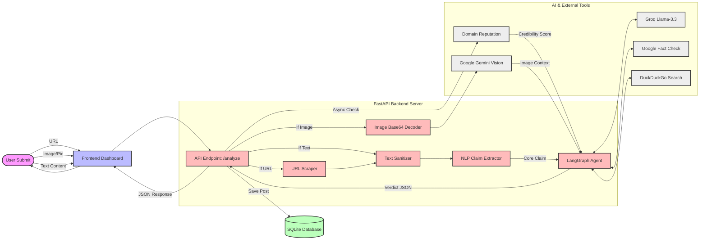

# SignalWatch — Explainable Misinformation Early-Warning System

SignalWatch detects, explains, clusters, and tracks suspicious online claims. It combines source reputation, linguistic signals, fact-check evidence, semantic clustering, narrative velocity, and user feedback in one responsive dashboard.

## Features

- Explainable verdicts with highlighted linguistic cues
- Gemini vision analysis for misleading or out-of-context images
- Fact-check evidence with supporting and refuting stances
- ML domain reputation using TLS, RDAP/WHOIS availability, age, and lexical features
- Gemini `text-embedding-004` semantic clustering with TF-IDF fallback
- Narrative velocity across 1-hour, 6-hour, and 24-hour windows
- Persistent thumbs-up/down feedback that tunes future scoring weights
- Server-sent events that refresh feeds and velocity dashboards live
- Filtered CSV and JSON exports
- Responsive browser interface with no frontend framework or CDN dependency

## Architecture

Here is the visual workflow representing how a claim flows through the system from the moment a user submits it, to when the final verdict is rendered.



## Stack

- Backend: FastAPI and Python 3.10+
- Frontend: semantic HTML, vanilla JavaScript, and vanilla CSS
- Database: SQLite
- AI: Google Gemini through the official `google-genai` SDK
- Clustering: Gemini embeddings and cosine similarity, with Scikit-Learn TF-IDF fallback

## Project structure

```text
backend/
  main.py                 FastAPI routes and frontend hosting
  database.py             SQLite schema and migrations
  seed.py                 Demonstration dataset
  services/
    claim_extractor.py    Claim and entity extraction
    clustering.py         Semantic clustering
    explainer.py          Explanations and highlights
    ingestion.py          URL ingestion and cleanup
    multimodal.py         Gemini visual-context analysis
    domain_reputation.py  Domain feature collection and ML classifier
    retriever.py          Fact-check retrieval
    veracity.py           Risk scoring and feedback learning
frontend/
  index.html              Browser application shell
  app.js                  API integration and interactions
  utils.js                Browser API and presentation helpers
  utils.py                Server-side frontend asset helper
  styles.css              Responsive visual system
requirements.txt
```

## Setup

```powershell
python -m venv .venv
.\.venv\Scripts\pip.exe install -r requirements.txt
```

Configure Gemini for claim extraction, explanations, and semantic embeddings:

```powershell
$env:GEMINI_API_KEY="your_gemini_api_key"
$env:GEMINI_EMBEDDING_MODEL="text-embedding-004"
```

Optionally configure Google Fact Check retrieval:

```powershell
$env:GOOGLE_FACT_CHECK_API_KEY="your_google_key"
```

Without API keys, the application falls back to local extraction, fact-check examples, and TF-IDF clustering.

## Run

```powershell
.\.venv\Scripts\python.exe -m uvicorn backend.main:app --port 8080 --reload
```

Open [http://127.0.0.1:8080](http://127.0.0.1:8080). FastAPI serves both the browser interface and API; no separate frontend process or Node.js installation is required.

Interactive API documentation remains available at [http://127.0.0.1:8080/docs](http://127.0.0.1:8080/docs).
